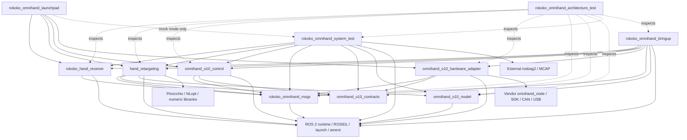

# Codebase Architecture — Rokoko 到 OmniHand O10 实时手部遥操作系统

> 状态：本文同时记录**当前事实**与已经接受但尚未完成的**目标设计**；各节分别标注。  
> Originating spec：[Rokoko 到 OmniHand O10 实时遥操作系统 Spec](../03_工程/01_Rokoko到OmniHand_O10实时遥操作系统Spec.md)，[GitHub Issue #1](https://github.com/jack-z36/Dexhit/issues/1)  
> Related ADRs：[ADR-0001](ADR/0001-o10-active-joint-constrained-kinematics.md)、[ADR-0002](ADR/0002-phase1-single-finger-ik-slsqp-analytic-gradient.md)、[ADR-0003](ADR/0003-o10-feedback-initialized-event-driven-slew-limit.md)、[ADR-0004](ADR/0004-o10-explicit-per-side-operator-arming.md)、[ADR-0005](ADR/0005-o10-recoverable-pause-vs-latched-fault.md)、[ADR-0006](ADR/0006-stale-recovery-validation-and-bounded-resume.md)、[ADR-0007](ADR/0007-o10-versioned-minimal-runtime-model-assets.md)、[ADR-0008](ADR/0008-o10-control-event-effect-hardware-port.md)、[ADR-0009](ADR/0009-phase1-owned-runtime-python.md)、[ADR-0010](ADR/0010-o10-fresh-active-joint-read-service.md)、[ADR-0011](ADR/0011-launchpad-real-hardware-test-boundary.md)、[ADR-0012](ADR/0012-launchpad-device-orchestration-layer.md)

本文只规定实时手部遥操作系统在 `collection` 阶段的代码结构、依赖方向、包边界、端口、所有权和架构门禁。业务行为以 originating spec 和相应接口契约为准；本文不重新定义算法、参数或产品范围。

## A. System Architecture（运行时数据流）

### 当前事实

当前受管业务源码只有 `omnihand_o10_control` ROS 2 Python 包。它订阅左右软目标 Topic，执行 10 维有限值和侧别限位校验后直接发布厂商位置 Topic。其 ROS glue、校验和厂商 bringup 依赖尚未分层；Rokoko 接收节点、手部重定向节点、自定义接口包和完整安全状态机尚未实现。

`src/collection/omni_hand/jazzy/` 是当前工作区中的厂商安装前缀和二进制运行产物，不是 Dexhit 拥有的源码包，也不进入本文的受管包依赖图。

### 目标设计

生产运行时链路由 Spec 固定，本文只为上下文重述：

```text
Rokoko Studio / Smartgloves
        │ JSON v3 over UDP
        ▼
Rokoko 接收节点
        │ /rokoko/{side}/raw_hand
        ▼
手部重定向节点
        │ /o10_control/{side}/command
        ▼
O10 控制节点
        │ O10HardwarePort
        ▼
厂商硬件 Adapter / omnihand_2025_node
        │ SDK / CAN / RS485 / USB
        ▼
实体 O10
```

外部 rosbag2/MCAP 观察 Raw、重定向状态、软目标、控制状态、最终命令与反馈；三个业务节点均不直接写 MCAP。

Launchpad 是运行在本机 `127.0.0.1:8710` 的控制面和设备编排层。T01 只提供
FastAPI/Vite 控制面、单实例生命周期与占位首页，不启动任何业务节点；后续 ticket
通过公开进程入口和 ROS 接口选择业务组合。Launchpad 不侵入业务节点内部状态机。

无真实硬件自动化验收使用相同的前三个业务节点，但以纯软件 Provider 代替厂商 Provider：

```text
JSON v3 UDP 测试源
        ▼
真实接收节点 → 真实重定向节点 → 真实 O10 控制节点
                                      │ O10HardwarePort
                                      ▼
                                纯软件 Provider
```

纯软件 Provider 不加载厂商动态库，不访问 CAN、RS485、USB、设备文件或实体 O10。

| 运行模块 | Owns | Must not |
| --- | --- | --- |
| Rokoko 接收节点 | UDP 接入、JSON v3 场景校验、Actor 选择、21 节点按名重排、左右 Raw 发布、接收统计 | 解释 O10 关节、执行人体归一化、复用坏侧历史、写 MCAP |
| 手部重定向节点 | 运行期人体尺度、人体掌坐标、方向映射、O10 指尖目标、耦合运动学、单指 IK、历史保持、动作平滑、stale 恢复、重定向状态 | 维护锁存故障、访问厂商 SDK、发送最终硬件命令、写 MCAP |
| O10 控制节点 | 软目标复核、逐侧控制状态、故障清除操作、手侧运动许可、锁存故障、反馈初始化硬限制、最终命令效果 | 解释人体动作、订阅 `RetargetingState` 驱动安全门、导入厂商 SDK、写 MCAP |
| 厂商硬件 Provider | 将 O10HardwarePort 映射到厂商节点、SDK 和实体设备，绑定逻辑手侧与设备 | 解释 Rokoko、运行 IK、拥有使能或安全状态机 |
| 纯软件 Provider | 在测试中实现同一 O10HardwarePort，确定性模拟反馈、错误、超时、重启与断连 | 出现在生产依赖、加载厂商库、接触真实设备 |
| 外部 rosbag2/MCAP | 订阅并记录已声明 Topic | 反向驱动控制、覆盖既有 `raw MCAP` |

厂商 Provider 和纯软件 Provider 是支撑 Adapter，不改变“三个稳定业务功能模块”的系统边界。

### 未知问题

- 厂商现有 ROS 节点没有已确认的无动作启动读取接口。项目侧 wire contract 已固定为逐侧 `ReadO10ActiveJoints` Service；生产 Provider 内部采用厂商扩展、SDK shim 还是升级后的正式接口仍未确定，但不能改变 Service 语义或降低反馈初始化前提。
- `joint_states` 是独立物理测量还是命令回显尚未确认，因此命令—反馈跟踪误差不进入当前安全判据。
- 真机 watchdog、真实通信时序和全部安全参数数值尚未验证，不得由代码结构推断。

## B. Codebase Architecture（编译与依赖结构）

### 当前事实

当前 `omnihand_o10_control` 把 ROS Node 和目标校验放在同一包中，`package.xml` 直接声明 `omnihand_node` 运行依赖，launch 同时启动厂商节点和控制节点。现有测试已经通过 ROS 图观察公开 Topic，可保留为行为测试 prior art；当前“合法命令直接转发”不是目标架构允许的生产旁路。

### 目标层级

本域沿“知道 ROS/外部框架最多 → 纯业务语义”向内分层，依赖只允许向内：

```text
Composition / External
        ↓
ROS Runtime & Adapters
        ↓
Application / Orchestration
        ↓
Core / Domain
        ↓
Types / Contracts
```

Ports 是 Application/Core 所依赖的抽象能力，Adapter 实现 Port；Port 不依赖 Adapter。对于安全关键控制，Application 接收纯事件并产出纯效果，ROS runtime 执行效果，而不是让状态机直接调用厂商 API。

`依赖只允许向内` 只约束自有**运行时**代码（Python 3 / `ament_python`）的 import 方向。`rokoko_omnihand_msgs`（ROSIDL wire schema）和 `omnihand_o10_model`（URDF/MJCF 资产）是 `ament_cmake`/ROSIDL 构建期产物，不承载运行时业务逻辑，也不进入上述运行时向内 import 层级栈；它们对 ROS 的依赖是构建期（ROSIDL / ament index）依赖，不属于 Core/Application 运行时 import 违规。因此本层级图的 `Types / Contracts` 仅指纯运行时值对象包 `omnihand_o10_contracts`；wire schema 由独立接口包 `rokoko_omnihand_msgs` 拥有，与纯类型包分属不同依赖层次。

| 层级 | Owns | May | Must not |
| --- | --- | --- | --- |
| Types / Contracts | 逻辑手侧、固定主动关节语义、限位、纯值对象、事件/效果数据结构（即 `omnihand_o10_contracts`）；ROS `.msg/.srv` wire schema 属独立构建期接口包 `rokoko_omnihand_msgs`，不在本运行时层内 | 使用标准库与纯类型依赖 | 导入 `rclpy`、Pinocchio、NLopt、厂商代码；拥有运行状态或算法 |
| Core / Domain | 人体几何、长度统计、耦合求值/雅可比、损失与候选判定、低通滤波、硬限速、纯安全谓词 | 依赖纯 Contracts 和数值基础库；接收显式时间和值 | 导入 ROS 消息、`rclpy`、launch、UDP、文件系统、ament index、厂商 SDK；发布 Topic |
| Application / Orchestration | 每侧会话状态、阶段转换、IK 调度、stale 恢复候选区、使能/故障状态机、事件到效果的原子转换 | 依赖 Core、Contracts 和 Port；接收 Adapter 产生的事件 | 导入厂商 SDK、CAN/USB、测试 Provider；直接构造或发布 ROS 消息；共享左右可变状态 |
| ROS Runtime & Adapters | Node 生命周期、QoS、参数、ROS message↔value object 转换、UDP socket、ROS/单调时钟、Pinocchio/NLopt/资产 Provider、Port 效果执行 | 依赖 Application/Core/Contracts/接口消息与外部库 | 拥有 IK/使能/故障规则；在回调中复制业务状态机；被内层导入 |
| Composition / External | launch、生产/测试 composition、厂商节点和 SDK、rosbag2、运行环境 | 依赖运行包，选择 Provider 并注入配置 | 被业务包导入；把测试 Provider 带入生产 composition；保存第二份业务事实 |

纯核心的判定标准是：导入并测试它不需要初始化 ROS、不需要模型安装空间、不需要网络或硬件。Pinocchio、NLopt 和 ament 资产查找属于 Adapter；数学公式、耦合系数的已解析表示和状态转换属于 Core/Application。

Phase 1 的 Dexhit 自有运行代码固定为 Python 3/`ament_python`。`rokoko_omnihand_msgs` 与 `omnihand_o10_model` 可使用 ROSIDL/`ament_cmake`，厂商外部节点可保持 C++。因此本架构的包内 AST/import 门禁覆盖全部自有业务运行代码；若未来将任一自有运行包迁移到 C++，必须先修订 ADR-0009，并加入 C/C++ include、CMake target link 和编译依赖门禁，不能在现有门禁盲区内直接迁移。

### 目标包布局

现有 ROS 业务包位于 `src/collection/omni_hand/`，Launchpad 是
`src/collection/` 下与其平级的独立 `ament_python` 包；两者都由 collection 的
colcon 入口发现。包名是依赖边界，不创建跨包 `utils`、`common` 或隐式共享目录。

```text
src/collection/
├── rokoko_omnihand_launchpad/            # 本机控制面与设备编排层（T01 骨架）
└── omni_hand/
    ├── rokoko_omnihand_msgs/             # ROSIDL wire schema
    ├── omnihand_o10_contracts/           # 纯 O10 共享语义和值对象
    ├── omnihand_o10_model/               # 无节点、版本锁定的核心资产
    ├── rokoko_hand_receiver/             # Rokoko 接收节点
    ├── hand_retargeting/                 # 手部重定向节点
    ├── omnihand_o10_control/             # O10 控制节点（改造现有包）
    ├── omnihand_o10_hardware_adapter/    # 生产 O10HardwarePort Provider
    ├── rokoko_omnihand_bringup/          # 仅生产 composition
    ├── rokoko_omnihand_system_test/      # 无真机 Provider 与端到端行为测试
    └── rokoko_omnihand_architecture_test/ # 跨包结构门禁
```

上述十一个受管包中只有 `rokoko_hand_receiver`、`hand_retargeting`、`omnihand_o10_control` 提供业务节点。`omnihand_o10_hardware_adapter` 可以提供厂商 shim/Provider 进程，但它是外部设备适配层，不拥有业务状态，因此不计为第四个稳定业务功能节点。Launchpad 是控制面进程，不是业务节点；消息、Contracts、资产和测试包不提供生产业务节点；bringup 只做 composition。

| 包 | Responsibility / Owns | Allowed dependencies | Must not |
| --- | --- | --- | --- |
| `rokoko_omnihand_msgs` | `RawHandFrame`、`RetargetingState`、`O10ControlState`、`ControlOperation` 及硬件 Port 所需 wire schema | ROSIDL、`std_msgs`、`geometry_msgs`、`builtin_interfaces`、`sensor_msgs` | 包含运行节点、算法、状态或配置默认值；依赖任何业务包 |
| `omnihand_o10_contracts` | `Side`、10 主动关节名称/索引/左右限位，以及跨重定向、控制和 Provider 使用的纯关节目标/反馈/错误/时间值对象 | Python 标准库；必要时仅类型依赖 | 拥有 O10HardwarePort 能力、控制事件/效果或会话状态；导入 ROS、模型、Pinocchio/NLopt、厂商或测试代码 |
| `omnihand_o10_model` | 左右生成态 URDF、左右 MJCF、provenance、SHA-256；不含节点 | ament 资源安装依赖 | 含 Xacro 运行路径、场景/网格必需依赖、外部绝对路径或运行算法；许可未确认时正式 vendoring |
| `rokoko_hand_receiver` | JSON decoder、Actor/手侧验证、21 节点重排、UDP/ROS runtime、Raw QoS、接收诊断 | `rokoko_omnihand_msgs`；ROS runtime；标准网络/JSON 库 | 依赖 O10 Contracts、模型、重定向或控制包；解释 O10 语义 |
| `hand_retargeting` | 人体归一化、模型装载 Adapter、耦合、单指 IK、动作平滑、stale 会话、RetargetingState 和软目标 runtime | `rokoko_omnihand_msgs`、`omnihand_o10_contracts`、`omnihand_o10_model`、Pinocchio/NLopt/数值库、ROS runtime | 依赖控制包、厂商节点/SDK、测试包；拥有锁存故障；发送最终命令 |
| `omnihand_o10_control` | 软目标验证、控制会话、O10HardwarePort 能力及纯控制事件/效果、故障清除、硬限速、控制状态和 clear_fault Service runtime | `rokoko_omnihand_msgs`、`omnihand_o10_contracts`、ROS runtime | manifest 或源码依赖 `omnihand_node`/厂商 SDK、重定向包或测试 Provider；订阅 RetargetingState 驱动控制 |
| `omnihand_o10_hardware_adapter` | 生产 O10HardwarePort wire Provider；把标准最终命令、反馈、错误查询与无动作主动关节读取映射到厂商节点/SDK | `rokoko_omnihand_msgs`、`omnihand_o10_contracts`、标准 ROS 消息、`omnihand_node`/经批准 SDK、ROS runtime | 被控制 Core/Application 导入；拥有故障/限速；解释人体动作；被无真机测试加载 |
| `rokoko_omnihand_bringup` | 生产 launch、参数文件定位、三业务节点与生产 Provider composition | 三业务运行包、生产硬件 Adapter、接口/资产包 | 包含业务规则、算法、测试 Provider；成为其他业务包依赖 |
| `rokoko_omnihand_system_test` | 纯软件 Provider、JSON fixtures、无真机 launch test、MCAP/端到端行为测试 | `rokoko_hand_receiver`、`hand_retargeting`、`omnihand_o10_control`、公开接口/Contracts/资产包和测试工具 | 依赖或加载 `omnihand_o10_hardware_adapter`、厂商节点/SDK/设备库；被任何生产包依赖；出现在生产 launch |
| `rokoko_omnihand_architecture_test` | 解析 package manifests/imports/launch 声明，执行本文跨包门禁 | 源码树元数据与测试工具 | 被生产包依赖；承载业务行为测试 |
| `rokoko_omnihand_launchpad` | 本机 FastAPI 控制面、无业务副作用的 `rclpy` spin、Vue/ECharts 静态前端、单实例锁和后续设备进程编排边界；T01 不启动业务节点 | FastAPI/uvicorn、rclpy、前端构建工具；后续按模式选择四个业务包，`rokoko_omnihand_system_test` 仅 mock 模式 | 导入业务内部状态、暴露 clear_fault；真机模式引用 `system_test`；被业务包反向依赖 |

每个业务包内部使用同一命名规则：

```text
package_name/contracts.py 或 contracts/   # 仅包内纯类型；跨包事实必须来自 omnihand_o10_contracts
package_name/core/                        # 纯计算
package_name/application/                 # 有状态编排
package_name/adapters/                    # ROS/UDP/数值/资产 Adapter
package_name/node.py                      # 薄 ROS composition root
```

这是逻辑层级，不要求提前创建空目录；只有对应实现出现时建立。`node.py` 只负责构造依赖、message 转换和 effects 执行，不保存第二份应用状态机。

### Dependency DAG

本图所有实线箭头统一表示“箭头起点在编译/运行时依赖箭头终点”。标准库不单独画边；所有第三方框架、数值后端、厂商依赖和外部工具均显式画出。



虚线 `inspects` 表示架构测试读取源码/manifest，不是生产 import 边；Launchpad 到
`system_test` 的虚线表示只有 mock 模式的可选编排引用。T01 骨架当前不声明这些
业务包 manifest 依赖，后续编排 ticket 必须按模式 adapter 落实该方向。`BAG` 只被测试/外部 composition 使用；三个业务节点不依赖 MCAP writer。生产 Provider 使用 wire schema 与 ROS 名称，但不能成为 Core/Application 的 import 依赖。

本 DAG 是**包级**依赖图；包内 `core/`、`application/`、`adapters/` 之间的方向无法由包级边表达，改由 A02/A03/A13 的包内 import lint 约束。例如 `hand_retargeting → NUM` 表示该包的 Adapter 使用 Pinocchio/NLopt，不表示 Application 直接依赖数值后端。

明确禁止的边：

- `Core → rclpy/ROS messages/launch`：纯计算不能依赖框架。
- `Core/Application → vendor SDK/omnihand_node/CAN/USB`：硬件只能在最外层 Provider 后面。
- `Application → adapters`：依赖必须倒置为 Port 或纯事件/效果。
- `omnihand_o10_control → hand_retargeting`：控制安全门不能读取重定向内部状态。
- `hand_retargeting → omnihand_o10_control`：两模块只通过软目标 wire contract 连接。
- `rokoko_hand_receiver → O10 packages`：Raw 边界不能知道机器人语义。
- `production package → rokoko_omnihand_system_test`：生产不能加载纯软件 Provider。
- `omnihand_o10_control → omnihand_o10_hardware_adapter`：控制只依赖 O10HardwarePort 纯事件/效果和 wire contract，生产 Provider 由 composition 选择。
- 任意受管包间循环：禁止双向 import 或 manifest 依赖。
- 任意包 → `utils/common` 共享汇：禁止建立无法确定事实所有权的依赖汇。

## Ports, Adapters & Providers

### 控制事件/效果 Port

`omnihand_o10_control` 的 Application 以纯事件驱动，每次状态转换返回零个或多个纯效果。ROS runtime 是唯一 effects executor。

核心事件至少表达：软目标到达、单调时刻、真实主动关节读取结果、错误查询结果、命令回读、Provider 连接变化、超时和操作者操作。核心效果至少表达：请求主动关节读取、请求错误状态、发送最终关节命令、发布控制状态和返回操作结果。

事件/效果中不得出现 ROS Node、Publisher、Client、Future 或厂商对象；它们只携带 `omnihand_o10_contracts` 的纯值。每侧 Application aggregate 原子处理一个事件并产生效果，runtime 只有在外部发送成功后才回送成功事件推进“上一实际发送命令”。

### 外部依赖映射

| External dependency | Boundary / Port | Single owner | Production Adapter / Provider | Test/Fake Adapter / Provider |
| --- | --- | --- | --- | --- |
| Rokoko UDP | Datagram ingress boundary；decoder 接收 `bytes + received_at` | `rokoko_hand_receiver` Adapter | UDP socket Adapter | 测试使用 loopback UDP 真实 ingress，不建立第二套 decoder |
| ROS 时间 | 各 ROS ingress 显式生成不可变时间值，不建立跨包共享 Port | 对应业务包 ROS runtime；Raw 接收时间只由 `rokoko_hand_receiver` 创建 | rclpy clock Adapter | 可控 ROS 时钟/显式 stamp fixture |
| 单调时钟 | `MonotonicClockPort.now()` 或等价显式 `now` 输入 | `omnihand_o10_control` Application | `time.monotonic`/steady clock Adapter | 可推进的 fake monotonic clock |
| O10 运动学 | `FingerKinematicsPort`：FK 与完整平移雅可比 | `hand_retargeting` Application | Pinocchio Adapter，从锁定 URDF 建模 | 确定性 fake 仅用于 Application 状态测试；真实 Pinocchio 用于数值契约测试 |
| 有界优化 | `FingerOptimizerPort`：有界单指候选与停止信息 | `hand_retargeting` Application | NLopt SLSQP Adapter | 确定性 fake 仅用于编排失败/恢复测试；真实 SLSQP 用于集成测试 |
| 主动—被动耦合 | `CouplingModel` 纯值和求值/雅可比 Core API；不是外部 Port | `hand_retargeting` Core | 严格 MJCF Loader Adapter 生成纯模型 | 小型固定 fixture；解析梯度仍需真实资产回归 |
| O10 模型资产 | `ModelAssetProvider`：按逻辑侧取得已验证 URDF/MJCF/provenance | `hand_retargeting` Application | ament index 安装空间 Adapter | 临时安装空间/外部只读 fixture；不得绕过哈希/结构校验 |
| O10 硬件 | `O10HardwarePort` 纯事件/效果能力；ROS wire contract 独立编码 | `omnihand_o10_control` Application | `omnihand_o10_hardware_adapter` 厂商 Provider | `rokoko_omnihand_system_test` 纯软件 Provider |
| 配置 | 每个业务包的不可变配置值对象；不是共享 Port | 对应业务包 Application | ROS parameter Adapter；启动时一次性解析/校验 | 显式测试配置，不使用生产默认 |
| MCAP | 公开 ROS Topic 观察边界；业务节点无 writer Port | 外部 collection 录制编排 | 外部 rosbag2 recorder | 系统测试 recorder |
| Launchpad HTTP/进程生命周期 | 本机 HTTP 控制面、单实例锁、子进程编排边界 | `rokoko_omnihand_launchpad` | T01 仅 FastAPI/uvicorn 入口；后续为业务进程 adapter | 替身进程与 HTTP 黑盒测试由 Launchpad 测试 seam 拥有 |

每个 Port 的能力形状由上表唯一 owner 定义；跨包纯值来自 `omnihand_o10_contracts`，ROS wire schema 来自 `rokoko_omnihand_msgs`。Port 不因为当前生产 Adapter 缺能力而降级。只有两个真实用途（生产 Provider 与纯软件 Provider，或真实数值后端与确定性测试后端）才建立 Port；普通纯函数不包一层接口。

## Public interfaces & ownership

### ROS public interfaces

| Interface | Contract summary | Single owner |
| --- | --- | --- |
| `/rokoko/{left,right}/raw_hand` | `RawHandFrame`；21 节点世界坐标、接收时间、源时间；发布 Reliable/Volatile/KeepLast(10)，重定向订阅 BestEffort/Volatile/KeepLast(1) | Rokoko 接收节点；wire type 由 `rokoko_omnihand_msgs` 拥有 |
| `/hand_retargeting/{left,right}/state` | `RetargetingState`；事件驱动、逐指尺度/IK/残差/恢复，只读诊断 | 手部重定向节点；wire type 由 `rokoko_omnihand_msgs` 拥有 |
| `/o10_control/{left,right}/command` | `JointState`；固定 10 name、rad 软目标、Raw 接收 stamp、空 velocity/effort | 手部重定向节点发布；O10 控制节点消费并独立复核 |
| `/o10_control/{left,right}/state` | `O10ControlState`；事件驱动、安全门、目标结果、限速与故障，只读诊断 | O10 控制节点；wire type由 `rokoko_omnihand_msgs` 拥有 |
| `/o10_control/{side}/clear_fault` | `ControlOperation`；空请求，返回结果码、说明和原子状态快照。运动由目标直接驱动，不再有 arm/disarm | O10 控制节点；wire type 由 `rokoko_omnihand_msgs` 拥有 |
| `/o10/{left,right}/joint_cmd` | `JointState`；最终受限 `position[10]`，保留 header，其他数组为空 | O10 控制节点产生；O10HardwarePort Provider 消费 |
| `/o10/{left,right}/joint_states` | 10 维主动关节反馈及接收时间语义 | O10HardwarePort Provider 产生；控制节点消费 |
| `/o10/{left,right}/joint_error_cmd` / `joint_error_states` | 主动查询与 10 关节厂商错误位 | O10HardwarePort Provider；控制节点拥有轮询策略 |
| `/o10/{left,right}/read_active_joints` | `ReadO10ActiveJoints`；空请求；Provider 在请求到达后执行无动作新读取，响应返回 `success`、`result_code`、`message`、`sample_stamp`、固定 `position[10]`；禁止返回历史 Topic 缓存 | O10HardwarePort 能力由控制 Application 拥有；wire type 由 `rokoko_omnihand_msgs` 拥有；生产/纯软件 Provider 实现 |

`ReadO10ActiveJoints.srv` 固定为：

```ros
# Empty request. Side is identified by the service name.
---
uint8 READ_SUCCESS=0
uint8 READ_DEVICE_UNAVAILABLE=1
uint8 READ_HARDWARE_ERROR=2
uint8 READ_INVALID_RESULT=3
uint8 READ_INTERNAL_ERROR=4

bool success
uint8 result_code
string message
builtin_interfaces/Time sample_stamp
float64[10] position
```

`position` 单位为 rad，顺序使用唯一 O10 主动关节契约。Provider 只有在请求到达后完成一次新读取，且结果身份正确、恰好 10 维、全部有限并处于对应侧限位内时，才能返回 `success=true`、`READ_SUCCESS` 和本次读取的 `sample_stamp`；失败响应的 `sample_stamp` 与 `position` 均不可使用。`message` 只供人读，调用方使用 `result_code` 判断。Service 的请求—应答提供相关性，控制客户端负责配置调用超时、响应一致性复核和 ROS 接收时间记录；客户端超时不是 Provider 响应码。启动初始化和清除锁存故障都使用该接口；它不能由首个目标或旧 `joint_states` 缓存代替。

### Pure APIs

下列是包内稳定 seam，不是新的 ROS 模块：

| Pure API | Input → output | Owner |
| --- | --- | --- |
| Rokoko scene decoder | `bytes, actor_index, received_at → per-side RawHandFrameValue / rejection diagnostics` | `rokoko_hand_receiver` Core |
| Retargeting session | `RawHandFrameValue / stale event → RetargetingDecision` | `hand_retargeting` Application |
| Coupling model | `active q → full q, d(full q)/d(active q)` | `hand_retargeting` Core |
| Finger IK objective/gradient/validity | `finger target, active q, kinematics result → loss/gradient/validity evidence` | `hand_retargeting` Core |
| Finger IK solve orchestration | `finger target, previous valid, model ports → candidate + stop/validity decision` | `hand_retargeting` Application |
| Control session | `ControlEvent → new ControlState + ControlEffects` | `omnihand_o10_control` Application |
| O10 active joint contract | `Side + 10-vector/stamp → immutable validated value or explicit rejection` | `omnihand_o10_contracts` |

ROS runtime converts wire messages at entry and converts pure decisions/effects at exit；Core/Application 不接收 ROS message 对象。

### State, type and configuration ownership

| Fact / state / config | Single owner |
| --- | --- |
| ROS message/service definitions and enum numeric values | `rokoko_omnihand_msgs` |
| 10 主动关节名称、索引、左右限位和逻辑侧纯语义 | `omnihand_o10_contracts` |
| O10HardwarePort 能力、控制事件/效果和客户端超时/复核语义 | `omnihand_o10_control` Application |
| `ReadO10ActiveJoints` ROS wire schema | `rokoko_omnihand_msgs` |
| `MonotonicClockPort` | `omnihand_o10_control` Application |
| `FingerKinematicsPort`、`FingerOptimizerPort`、`ModelAssetProvider` | `hand_retargeting` Application |
| `CouplingModel` 求值和解析雅可比 API | `hand_retargeting` Core |
| 21 Rokoko 节点规范拼写与 Actor/JSON 校验规则 | `rokoko_hand_receiver`；由版本化官方 JSON fixture 固定 |
| Raw 接收时间 | Rokoko 接收 runtime 在 UDP ingress 创建；下游只继承 |
| 每侧人体长度窗口、冻结值、上一有效单指目标、恢复候选和动作平滑滤波状态 | `hand_retargeting` 对应侧 Application aggregate |
| O10 几何、frame、指根、指链长度与耦合来源 | `omnihand_o10_model` 资产；`hand_retargeting` Model Adapter 解析，不复制常量 |
| 每侧 `fault_latched`、目标新鲜度、错误监控、限速基准和时间基准 | `omnihand_o10_control` 对应侧 Application aggregate |
| `motion_enabled` | O10 控制 Application 从自有状态派生，只读 |
| 设备 ID、连接方式、通道和厂商 SDK 生命周期 | 生产 O10HardwarePort Provider 配置 |
| 厂商节点/SDK 到 O10HardwarePort wire contract 的映射 | `omnihand_o10_hardware_adapter` |
| 生产 composition | `rokoko_omnihand_bringup` |
| 无真机 Provider、故障注入与系统 fixture | `rokoko_omnihand_system_test` |
| MCAP 文件生命周期 | 外部 collection 录制编排，不属于三个业务节点 |
| Launchpad 单实例所有权、监听地址和占位首页 | `rokoko_omnihand_launchpad` 控制面 |

左右 aggregate 不共享可变状态；共享模型和不可变配置必须只读。

## Architecture invariants → enforcement

状态说明：`ENFORCED` 表示对应结构测试已进入 `rokoko_omnihand_architecture_test`，并由 `colcon test` 执行；外部 SDK、资产许可和真机行为仍按各票据状态单独记录。`manual review only` 表示无法可靠静态证明。

| ID | Invariant (MUST / MUST NOT) | Mechanism | Gate | Status |
| --- | --- | --- | --- | --- |
| A01 | 所有受管生产包依赖 MUST 构成本文 DAG，MUST NOT 有循环 | 解析 `package.xml` 和 Python imports 构图，输出非法路径 | `test_package_dependency_graph` | ENFORCED |
| A02 | 自有 Python `core/` MUST NOT 导入 rclpy、ROS message、launch、ament index、网络、文件 I/O 或厂商代码 | Python AST import lint + 禁止模块表 | `test_import_boundaries` | ENFORCED |
| A03 | 自有 Python `application/` MUST NOT 导入 ROS runtime、Adapter、厂商代码或测试 Provider | Python AST import lint + 允许边表 | `test_import_boundaries` | ENFORCED |
| A04 | `omnihand_o10_control` MUST NOT 在源码或 manifest 依赖 `omnihand_node`、`omnihand_o10_hardware_adapter`、SDK、CAN/USB 包 | manifest/Python import lint | `test_control_has_no_vendor_dependency` | ENFORCED |
| A05 | `rokoko_hand_receiver` MUST NOT 依赖 O10 Contracts、模型、重定向或控制 | manifest/Python import DAG test | `test_receiver_stops_at_raw_boundary` | ENFORCED |
| A06 | 重定向与控制 MUST NOT 互相 import；只能经 JointState wire contract 连接 | manifest/Python import DAG test | `test_retarget_control_are_decoupled` | ENFORCED |
| A07 | 控制 runtime MUST NOT 订阅 `RetargetingState` 或以其状态驱动运动许可 | ROS interface declaration/launch introspection test + source scan | `test_control_interfaces_are_independent` | ENFORCED |
| A08 | 生产包 MUST NOT 导入或依赖 `rokoko_omnihand_system_test`；生产 launch MUST NOT 启动纯软件 Provider | manifest/Python import lint + launch structure test | `test_production_excludes_test_provider` | ENFORCED |
| A09 | 纯软件 Provider MUST NOT 依赖厂商节点、SDK、动态库或设备 API | manifest/import/binary-name scan；CI 无设备运行 | `test_software_provider_has_no_vendor_surface` | ENFORCED；真实设备隔离仍需人工复核 |
| A10 | `omnihand_o10_hardware_adapter` 与纯软件 Provider MUST 满足同一 O10HardwarePort 能力和 wire contract，包括新鲜读取 Service | 共享 contract suite：硬件 Adapter 包在无设备时做 schema/interface 测试，system-test 对纯软件 Provider 做完整契约测试；真机行为后验 | `test_o10_hardware_port_contract` | ENFORCED；生产真实读取仍未真机验证 |
| A11 | O10 主动关节名称、索引和限位 MUST 只有 `omnihand_o10_contracts` 一个代码 owner | Python AST 扫描禁止其他包定义同名常量；contract imports test | `test_o10_contract_single_source` | ENFORCED |
| A12 | URDF/MJCF/provenance MUST 从 ROS 安装空间加载，MUST NOT 使用开发者绝对路径 | 资产结构/hash test + Python AST 字符串扫描 + 临时安装空间启动测试 | `test_model_asset_boundary` | ENFORCED；固定外部资产当前不可下载 |
| A13 | Pinocchio/NLopt MUST 只出现在重定向 Adapter，MUST NOT 泄漏到 Contracts、Core/Application API | Python import lint + public signature introspection | `test_numeric_backends_are_adapters` | ENFORCED |
| A14 | 控制业务状态转换 MUST 只发生在每侧 Control Application aggregate；ROS Node 不得保存第二份使能/故障/限速状态机 | 状态字段命名/source scan只能发现部分违规 | reviewer checklist：Node 只转换消息/执行 effects；无重复状态字段 | manual review only |
| A15 | 重定向每侧状态 MUST 由独立 aggregate 拥有，左右 MUST NOT 共享可变历史 | 构造两侧 session 的身份/变更隔离结构测试 | `test_side_aggregate_isolation` | ENFORCED |
| A16 | ROS `.msg/.srv` numeric enums 和字段 MUST 只在接口包定义，消费者不得复制 numeric literals | generated interface contract test + Python source scan | `test_wire_contract_single_source` | ENFORCED |
| A17 | 业务包 MUST NOT 创建 `utils`/`common` 跨包依赖汇 | 路径和 Python import lint | `test_no_dependency_dumping_ground` | ENFORCED |
| A18 | 安全/性能未标定参数 MUST 是显式必需配置，MUST NOT 伪装成真机安全默认值 | 参数 schema test：缺失时启动失败；来源元数据检查 | `test_required_experimental_parameters` | ENFORCED；参数是否安全仍需 manual review |
| A19 | `src/collection/omni_hand/jazzy/` MUST 作为外部安装产物，不得成为源码 import、绝对路径或受管包 owner | manifest/import/path lint；构建在干净外部 prefix 复现 | `test_vendor_prefix_is_external` | ENFORCED |
| A20 | 生产 composition MUST 只包含三个 Dexhit 业务节点、允许的生产 Provider/shim 和外部厂商节点；任何测试包或纯软件 Provider MUST NOT 出现 | launch structure test + executable/package allowlist inventory | `test_production_business_node_inventory` | ENFORCED；厂商 Provider/shim 进程不计为业务节点 |
| A21 | 硬件 Adapter、bringup、消息、资产和测试包 MUST NOT 拥有运动使能（`4fedfaa` 起无 `armed`）、故障、IK、stale 或限速业务状态 | reviewer checklist：逐包检查 state fields、callbacks 和 lifecycle ownership | reviewer checklist | manual review only |
| A22 | Phase 1 Dexhit 自有运行包 MUST 使用 Python 3/`ament_python`；若引入 C++，必须先加入 include/CMake/link 门禁并更新 ADR | manifest build_type/executable inventory test | `test_owned_runtime_language_policy` | ENFORCED |
| A23 | Launchpad MUST be a sibling package under `src/collection`, MUST bind its T01 control plane to `127.0.0.1:8710`, and MUST NOT start business nodes | package/source boundary test plus T01 black-box HTTP test | `test_launchpad_skeleton_boundary` | ENFORCED |
| A24 | Launchpad MUST NOT make production composition depend on `rokoko_omnihand_system_test`; only a mock-mode adapter may reference that package | manifest/import/source scan; mode-specific composition test in later ticket | `test_production_excludes_test_provider` plus launchpad boundary gate | ENFORCED for T01 skeleton; mock-mode behavior pending |

任何 GAP 未关闭前，相应 invariant 只能算目标设计。架构测试必须作为 `colcon test` 和 CI 的阻断步骤；不能仅在文档中声明“遵守”。

## Architecture tests vs behavior tests

### Architecture / structural tests

跨包结构测试由 `rokoko_omnihand_architecture_test` 拥有，局部 public-signature/import 测试可放在受约束包的 `test/` 中。它们只证明代码没有长歪：

- package manifest 与 import DAG 无环且边合法；
- Core/Application 不导入 ROS、Adapter、厂商或测试代码；
- 控制包不再直接依赖 `omnihand_node`，生产包不依赖纯软件 Provider；
- 生产与纯软件 Provider 暴露同一 O10HardwarePort contract；
- 消息、主动关节契约、模型资产和状态 owner 没有重复定义；
- 生产 launch、无真机 launch 和 executable inventory 不跨越 composition 边界；
- 所有结构测试进入 `colcon test` 与 CI，失败时输出具体非法边或 owner。

架构测试不验证 IK 是否准确、限速值是否正确或故障时是否停止命令。

### Behavior tests

行为测试由各业务包和 `rokoko_omnihand_system_test` 拥有，按照 Spec 的无真机主接缝验证：

- JSON v3/RawHandFrame 解析、逐侧坏包隔离和 QoS；
- 人体归一化、长度冻结、耦合、单指 IK、解析梯度、动作平滑和 stale 恢复；
- 手侧运动使能、锁存故障、清除流程和最终关节变化率硬限制；
- 从 UDP 到纯软件 Provider 的完整 ROS 图、状态 Topic、Service、MCAP 可录制性与吞吐基准。

行为测试不得为了方便绕过公开 seam 去断言 Node 私有调用。纯数学的梯度/资产测试是必要的离线契约检查；它们不扩大生产 public API。

## Open questions

以下问题来自 Spec/当前事实，架构不静默回答：

1. **生产无动作主动关节读取的厂商内部实现**：项目 wire contract 已固定为逐侧 `ReadO10ActiveJoints` Service；现有厂商 ROS 节点仍不具备该能力。生产硬件 Adapter 内部使用 SDK shim、厂商扩展还是升级后的正式接口尚未确定，但不能改变 wire contract、返回缓存或降低验证要求。
2. **模型资产许可**：上游提交未附许可证正文。许可确认前 `omnihand_o10_model` 只能建立包结构、loader 和外部 fixture 测试，不能正式 vendoring 资产。
3. **Rokoko 21 节点真实拼写与 source timestamp 时基**：由官方 JSON v3 fixture/真实包固定；时基未知时只原样录制。
4. **Python 重定向性能余量**：Phase 1 实现语言已经由 ADR-0009 固定为 Python，Pinocchio/NLopt 通过 Adapter 隔离。必须以无真机 benchmark 证明双手可持续吞吐；若证据要求跨语言迁移，先修订 ADR 与架构门禁，不能在当前门禁之外直接引入 C++。
5. **安全与算法参数数值**：窗口、残差、优化、滤波、stale、恢复、轮询、超时、速度与时间额度均待实验标定；架构只强制显式配置与单位来源。
6. **厂商反馈物理语义和 watchdog**：未确认前不增加跟踪误差故障规则，也不假设上游静默会触发硬件自动停止。

若第 1 项的厂商内部实现产生新的长期锁定，或第 4 项要求跨语言迁移，应通过 `/domain-modeling` 新增或修订 ADR；ARCHITECTURE.md 只链接决策，不复制理由。

## Handoff

后续 `/to-tickets` 必须同时读取：

- [Rokoko 到 OmniHand O10 实时遥操作系统 Spec](../03_工程/01_Rokoko到OmniHand_O10实时遥操作系统Spec.md)；
- 本文 `ARCHITECTURE.md`；
- 本文引用的 O10 ADR 与接口契约。

Tickets 可以按纵向行为切片，但不得重新决定包边界、依赖方向、状态 owner、Port/Provider 隔离和架构门禁。本文不创建 tickets，也不授权实现或真机操作。
