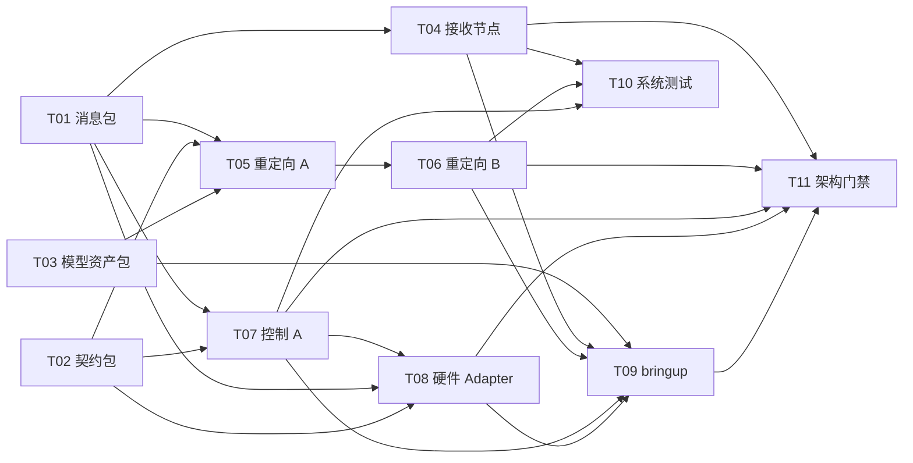

# Rokoko 到 OmniHand O10 Phase 1 实施计划

> 状态：计划内指标已完成并按证据勾选；真机/现场验收与许可确认仍按边界保留为未验证事项
> 输入：[Spec](01_Rokoko到OmniHand_O10实时遥操作系统Spec.md)、[ARCHITECTURE](../01_知识/ARCHITECTURE.md)、[O10 ADR](../01_知识/ADR/INDEX.md)

本计划按纵向 tracer-bullet 切片拆分 Phase 1 实现工作。每个切片声明交付行为与阻塞边；不重新决定包边界、依赖方向、状态 owner、Port/Provider 隔离或架构门禁——这些由 ARCHITECTURE 固定。切片只描述端到端行为，不写具体文件路径或代码。

## 实施顺序与阻塞关系

箭头表示「阻塞者 → 被阻塞者」，即箭头起点完成前、终点不能开始。

## 纵向切片

### T01 — `rokoko_omnihand_msgs` 消息包

**Blocked by**：无，可立即开始。

**交付**：三节点与硬件边界的全部 wire schema 定义，成为跨包通信的唯一事实来源。

- [x] `RawHandFrame` 含 header、Actor 索引/名称、source timestamp、规范顺序 21 名称/位置/四元数，手侧由 Topic 表达。
- [x] `ReadO10ActiveJoints.srv` 固定为空请求 + 5 个枚举结果码 + `success`/`result_code`/`message`/`sample_stamp`/`float64[10] position`。
- [x] `RetargetingState`、`O10ControlState`、`ControlOperation` 覆盖 Spec 决策 35/52/43 的字段；`SOLVER_NOT_RUN=0` 已命名。
- [x] 枚举数值只在消息包定义，消费者不复制 numeric literal（A16 gate 已通过）。

### T02 — `omnihand_o10_contracts` 契约包

**Blocked by**：无，可立即开始。

**交付**：纯 O10 共享语义与值对象，作为重定向、控制和 Provider 的共同类型层。

- [x] `Side` 表达 `left`/`right` 纯逻辑手侧。
- [x] 10 主动关节名称/索引/左右限位只有本包一个 owner（A11 gate 已通过；模型包只派生只读视图）。
- [x] 纯值对象：关节目标/反馈/错误/时间，校验 10 维、有限、限位内。
- [x] 不 import ROS、模型、Pinocchio/NLopt、厂商或测试代码。

### T03 — `omnihand_o10_model` 模型资产包

**Blocked by**：无，可立即开始。

**交付**：无节点、版本锁定的 O10 几何/耦合资产加载与校验能力；许可确认前只挂外部只读 fixture。

- [x] 从 ament 安装空间加载资产，不用开发者绝对路径（A12 gate 已通过）。
- [x] 严格 MJCF loader：6 条主动—被动关系、名称唯一、5 个有限 polycoef、左右拇指差异。
- [x] URDF 结构校验：`nq=nv=16`、主动顺序、限位、palm/root/tip frame（结构校验已测；Pinocchio 运行时断言仍受环境阻断）。
- [x] provenance/SHA-256 校验工具；许可确认前不正式 vendoring 资产。

### T04 — Rokoko 接收节点

**Blocked by**：T01。

**交付**：UDP JSON v3 → `/rokoko/{side}/raw_hand` 的原始手部帧发布，坏包与坏侧不污染另一侧。

- [x] JSON v3 解码、Actor 选择、场景级校验；场景失败或 Actor 不存在时双侧不发布。
- [x] 21 节点按名重排，不信任源数组顺序。
- [x] 逐侧坏包隔离：一侧缺失/非法只丢该侧，合法另一侧继续发布。
- [x] Raw QoS Reliable/Volatile/KeepLast(10)；双手共享同一场景接收时间。
- [x] loopback UDP + fixture 覆盖；包内 22 tests 全绿。真实 Rokoko Studio 抓包仍未提供。

### T05 — 重定向 A：人体归一化与长度冻结

**Blocked by**：T01、T02、T03。

**交付**：RawHandFrame → 人体掌坐标 + 尺度归一化指尖目标 + 逐指长度状态，`RetargetingState` 推进到就绪前阶段。

- [x] 人体掌坐标由 Hand + 四指 Proximal 几何构造，不使用 `Hand.rotation`。
- [x] 纵向/横向轴退化判据；任一轴低于有效范数阈值整侧当前帧无效。
- [x] 五指长度用滑动窗口中位数 + 归一化 MAD 判稳，连续 K 窗口后冻结。
- [x] 尺度归一化指尖目标：除以冻结人体指链长度 × O10 指链长度 + 固定方向映射。
- [x] 五指全冻结前该侧不输出软目标。
- [x] `RetargetingState` 用 `length_state` 表达冻结事实；五指全冻结后直接进入 `WAITING_FIRST_VALID_IK`，不保留独立整体 `FROZEN` 阶段。
- [x] 冻结尺度异常：单指异常只该指无效；影响掌坐标构造时整侧当前帧无效。

### T06 — 重定向 B：单指 IK + 耦合 + 动作平滑

**Blocked by**：T05。

**交付**：耦合运动学 + 单指有界 IK + 动作平滑，输出 `/o10_control/{side}/command` 软目标。

- [x] MJCF 主动—被动耦合派生，只优化主动关节（纯契约/fixture 已测）。
- [x] 单指有界 IK：SLSQP + 解析梯度（Pinocchio 平移雅可比 × 耦合雅可比）代码与 fake seam 测试已完成。
- [x] 候选有效性独立于求解停止原因；达到评估/时间上限不自动失败，正常收敛残差超标也不自动成功。
- [x] 首次求解用关节范围中点，后续用上一有效解 warm start。
- [x] 动作平滑：按 Raw 接收时间 dt 的一阶低通，不使用 source timestamp 或求解墙钟时间。
- [x] 组合 10 维 soft `JointState` 发布到 `/o10_control/{side}/command`，header 继承 Raw 接收时间，velocity/effort 为空。
- [x] 单指失败历史保持；五指首解未齐前整侧不发布组合目标。
- [x] 解析梯度用固定 commit 的真实左右资产、五指和左右拇指不同耦合中心差分验证；外部 mamba 环境已用 Fclash `127.0.0.1:7890` 安装，真实 Jacobian/目标梯度 4/4 通过。

### T07 — 控制 A：控制包重构 + 事件/效果 Port + 软件 Provider

**Blocked by**：T01、T02。

**交付**：`omnihand_o10_control` 分层重构并完成逐侧安全状态机，输出 `/o10/{side}/joint_cmd`；软件 Provider 供无真机测试。

- [x] 分层重构为 contracts/core/application/adapters/node，去除 `omnihand_node` manifest/源码依赖（A04 gate 已通过）。
- [x] `O10HardwarePort` 事件/效果边界；runtime 是唯一 effects executor，成功发送后才回送成功事件推进基准。
- [x] 逐侧 `armed`/`fault_latched`/硬限速状态机；启动 `armed=false`，运动许可为只读派生合取。
- [x] 硬限速：真实反馈初始化 + 单调时钟 + 单次时间额度封顶；无效目标不推进基准。
- [x] `arm`/`disarm`/`clear_fault` Service + 固定拒绝优先级；失败不排队，重复幂等。
- [x] 锁存故障：错误位/回读超时/非法反馈/重启断连触发，撤销授权，不自动恢复。
- [x] 输出 `/o10/{side}/joint_cmd`，header 保留、name/velocity/effort 为空。
- [x] 软件 Provider 无厂商依赖，可注入确定性反馈/错误/超时/重启/断连（A09 gate 已通过）。
- [x] 保留并升级现有 ROS 图测试为 prior art；T07 控制包 65 tests、ROS 图 6/6 通过。

### T08 — 生产硬件 Adapter

**Blocked by**：T01、T02、T07（与 T07 共享 A10 契约套件）。

**交付**：生产 Provider 把 wire contract 映射到厂商节点/SDK，含无动作主动关节读取。

- [x] 正式 Agilink SDK 接入后的生产 Provider 已映射命令、反馈、错误查询和 `ReadO10ActiveJoints`；正式 SDK wheel/真机运行仍单独保留为硬件验证项。
- [x] `ReadO10ActiveJoints` 抽象每次请求调用新读取，不返回历史 Topic 缓存；fake backend 计数测试通过。
- [x] 无设备 schema/interface 测试 8/8 通过；真机行为仍留待硬件验证（A10 seed）。

### T09 — `rokoko_omnihand_bringup` 生产 composition

**Blocked by**：T03、T04、T06、T07、T08。

**交付**：生产 launch 组合三业务节点与生产 Provider，注入显式必需配置。

- [x] launch 只包含三业务节点、生产 Adapter 与外部厂商 launch；不含测试包或纯软件 Provider（A20 gate 已通过）。
- [x] 参数文件、vendor launch 路径和 Provider 两侧 transport 参数显式必填，缺失或 SDK 构造失败即启动失败（A18 gate 已通过）。未执行真机生产启动。

### T10 — 端到端系统测试 + MCAP + 故障注入

**Blocked by**：T04、T06、T07。

**交付**：loopback UDP → 软件 Provider 的完整 ROS 图无真机验收，含确定性故障注入与 MCAP 录制。

- [x] 完整成功的 UDP → IK → 控制 → 软件 Provider 命令路径；外部真实模型 + Pinocchio/NLopt 环境下 T10 system-test 21/21 通过。未执行真机 Provider 路径。
- [x] 故障注入：错误位/错误查询超时/反馈读取超时/回读超时/非法反馈/非法错误状态/重启/断连均有确定性测试。
- [x] MCAP 可录制 Raw/状态/软目标/最终命令/反馈；录制由外部 rosbag2 执行，节点本身不写 MCAP。
- [x] 只通过公开 UDP、Topic/Service 观察，不调用业务节点私有方法。
- [x] 吞吐基准已记录：双侧 UDP→Raw 约 543.9 frame/s，接收年龄 p50 36.7 ms、p95 69.6 ms；IK 吞吐待模型环境可用后测量。

### T11 — 架构门禁落地

**Blocked by**：T04、T06、T07、T08、T09。

**交付**：`rokoko_omnihand_architecture_test` 包，把 ARCHITECTURE 的 A01–A22 落地为 `colcon test`/CI 阻断步骤。

- [x] 20 条 GAP 门禁实现为可运行的跨包结构测试，当前 20/20 通过。
- [x] 2 条 `manual review only` 落成逐包审查清单；A14/A21 已由 Kepler (`gpt-5.6-luna`) 只读 reviewer PASS 并记录 working-tree revision。
- [x] 门禁失败时输出具体非法边、路径或 owner。

## 跨切片边界与约束

- 不重新决定包边界、依赖方向、状态 owner、Port/Provider 隔离或架构门禁；冲突时以 ARCHITECTURE 与 ADR 为准并显式上报。
- 许可确认前，模型资产只挂外部只读 fixture，不正式 vendoring（ADR-0007）。
- 生产无动作主动关节读取的厂商内部实现待定，但不得改变 `ReadO10ActiveJoints` wire contract 语义（Open question #1）。
- 全部安全/算法参数为显式必需配置，不得伪装成真机安全默认值。
- 真机 watchdog、通信时序与安全参数数值不在此阶段验证（Spec Out of Scope）。

## 未决（外部阻断）

- 模型上游许可确认（影响 T03 的正式 vendoring 部分）。
- 厂商无动作读取接口的正式落地（影响 T08 真机行为验证）。
- Rokoko 21 节点真实拼写与 source timestamp 时基，由官方 JSON fixture 固定。
